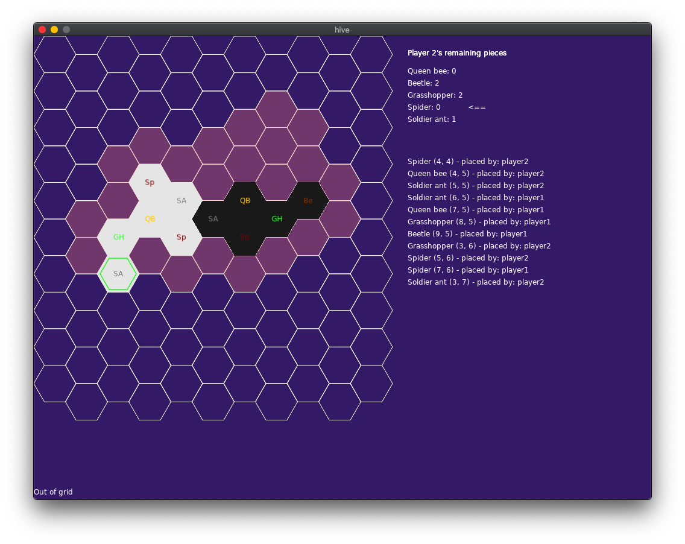

# HIVE Abstract game
* https://love2d.org
* a, s and click to select piece

## Architecture

This is a LÖVE2D-based implementation of the Hive board game. The codebase is organized into a modular structure with clear separation of concerns.

### Module Hierarchy

```
main.lua (Entry Point)
├── config.lua                    # Game configuration
├── animation.lua                 # Animation system
├── console.lua                   # Debug console
│
├── game.lua                      # Core game logic
│   ├── player.lua                # Player management
│   ├── globals.lua               # Global state
│   ├── hexagon.lua               # Hexagon drawing/math
│   ├── map.lua                   # Game board/map
│   ├── pieces.lua                # Piece initialization
│   │   ├── config.lua
│   │   └── pieces/               # Individual piece types
│   │       ├── pieces_enum.lua   # Piece type constants
│   │       ├── piece.lua         # Base piece class
│   │       ├── movement_utils.lua # ⭐ Shared movement logic
│   │       ├── queenbee.lua
│   │       ├── beetle.lua
│   │       ├── grasshopper.lua
│   │       ├── spider.lua
│   │       ├── soldierant.lua
│   │       ├── ladybug.lua
│   │       ├── mosquito.lua
│   │       └── pillbug.lua
│   └── cubecoords.lua            # Cube coordinate system
│
├── graphics.lua                  # Rendering system
│   ├── hexagon.lua
│   ├── map.lua
│   ├── cubecoords.lua
│   └── animation.lua
│
├── ui.lua                        # User interface
│   ├── cubecoords.lua
│   ├── map.lua
│   ├── network.lua               # (lazy loaded)
│   └── pieces/pieces_enum.lua    # (lazy loaded)
│
├── input.lua                     # Input handling
│   ├── pieces/pieces_enum.lua
│   ├── cubecoords.lua
│   ├── gamestate.lua             # Save/load system
│   ├── console.lua
│   ├── network.lua
│   ├── globals.lua
│   ├── game.lua
│   ├── map.lua
│   └── camera.lua                # ⭐ Camera controls
│
├── camera.lua                    # ⭐ Camera zoom & pan
│
└── network.lua                   # Multiplayer networking
    └── game.lua

Utility Modules:
├── cubecoords.lua               # Hexagonal coordinate math
├── hexagon.lua                  # Hexagon geometry
├── map.lua                      # Board state management
├── gamestate.lua                # Serialization
├── camera.lua                   # ⭐ Camera controls (zoom & pan)
└── json.lua                     # JSON parser
```

### Core Systems

1. **Game Loop** ([main.lua](main.lua))
   - Entry point and LÖVE2D callbacks
   - Coordinates update/draw cycles

2. **Game Logic** ([game.lua](game.lua))
   - Game initialization and state
   - Win condition checking
   - Turn management

3. **Rendering** ([graphics.lua](graphics.lua))
   - Board rendering
   - Piece visualization
   - Animation display

4. **User Interface** ([ui.lua](ui.lua))
   - Piece selector
   - Tooltips and overlays
   - Game over screen

5. **Input System** ([input.lua](input.lua))
   - Mouse and keyboard handling
   - Delegates camera controls to [camera.lua](camera.lua)
   - Game state controls

6. **Camera** ([camera.lua](camera.lua))
   - Zoom in/out (mouse wheel, +/- keys)
   - Pan (drag with right/middle click)
   - Screen ↔ world coordinate conversion

7. **Network** ([network.lua](network.lua))
   - LAN multiplayer via LuaSocket
   - Server/client architecture
   - Move synchronization

8. **Coordinate System** ([cubecoords.lua](cubecoords.lua))
   - Hexagonal grid mathematics
   - Pixel ↔ cube coordinate conversion

## Controls
- **a/s**: Cycle through piece types to place
- **Left click**: Place piece or select/move piece
- **Right/Middle click + drag**: Pan camera
- **Mouse wheel** or **+/-**: Zoom in/out
- **0**: Reset zoom to 1.0x
- **h**: Toggle hex coordinate display
- **c**: Toggle console
- **x**: Clear console
- **d**: Export game state to file
- **l**: Load game state from file

## Multiplayer (LAN)
- **n**: Host a network game (becomes Player 1)
- **m**: Join a network game (becomes Player 2)
- **q**: Quit network game

### How to Play Multiplayer
1. **Host:** Press `n` on one computer to host a game (default port 12345)
2. **Join:** Press `m` on another computer on the same network to join
3. The host (Player 1) goes first, then players alternate turns
4. Moves are automatically synchronized over the network

**Note:** Requires LuaSocket. Install with: `luarocks install luasocket`

## Testing

The project includes automated tests using the [Busted](https://lunarmodules.github.io/busted/) testing framework.

### Setup

```bash
# Install Lua and luarocks (if not already installed)
brew install lua luarocks

# Install Busted test framework
luarocks install --local busted
```

### Running Tests

```bash
# Run all tests
eval $(luarocks path --bin) && busted

# Run tests with verbose output
eval $(luarocks path --bin) && busted --verbose

# Run specific test file
eval $(luarocks path --bin) && busted tests/camera_spec.lua
```

### Test Coverage

**81 tests** covering core modules:
- **camera.lua** (23 tests) - Zoom, pan, coordinate conversion
- **cubecoords.lua** (44 tests) - Hexagonal coordinate math
- **movement_utils.lua** (14 tests) - Common movement logic

All tests pass with 0 failures.



